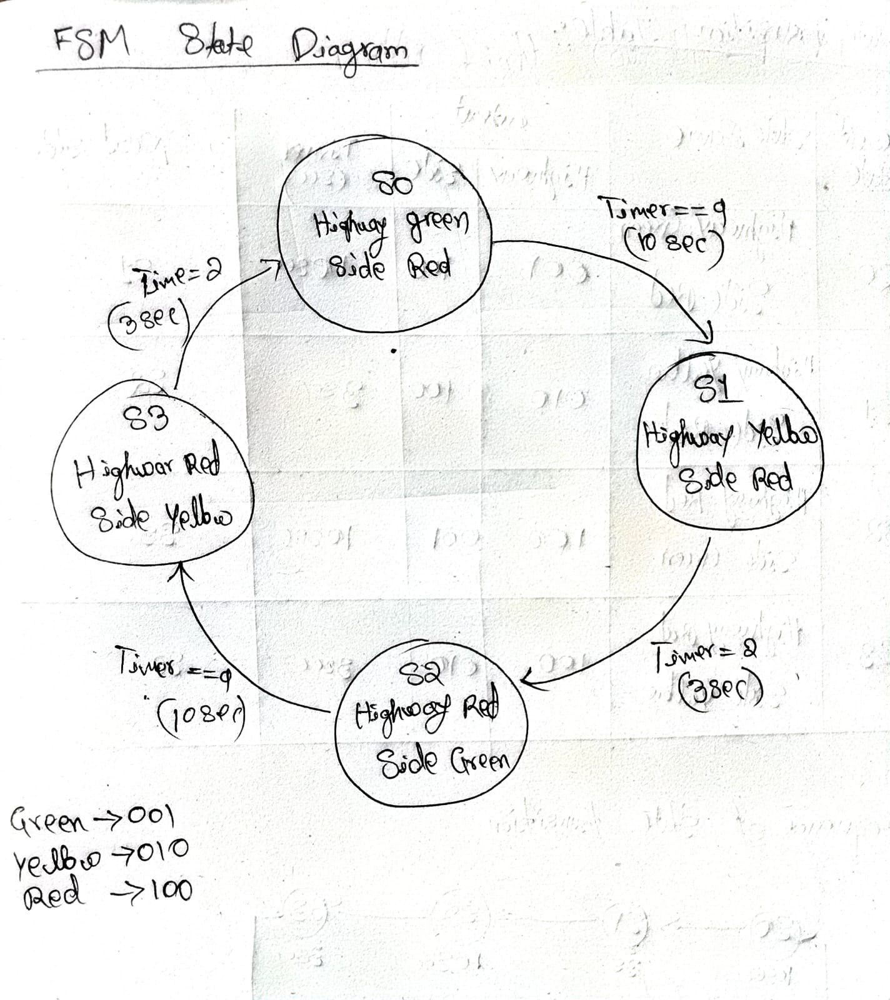
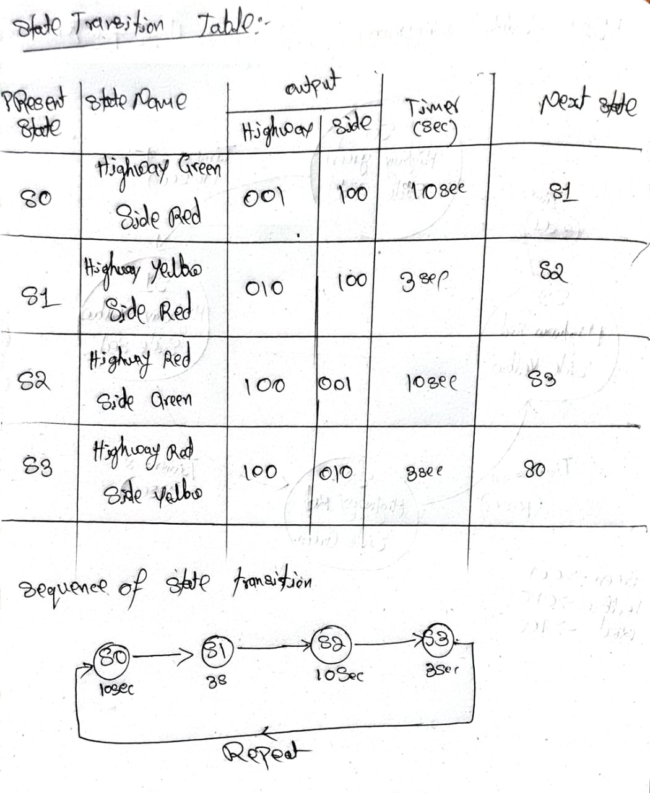
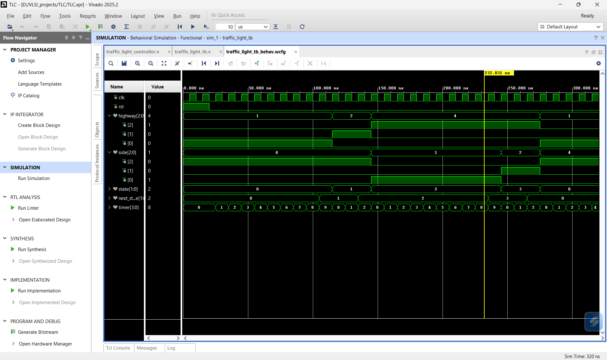
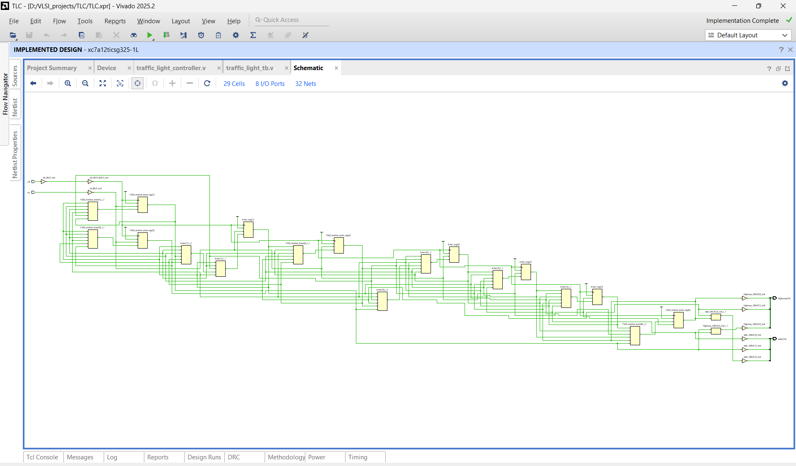
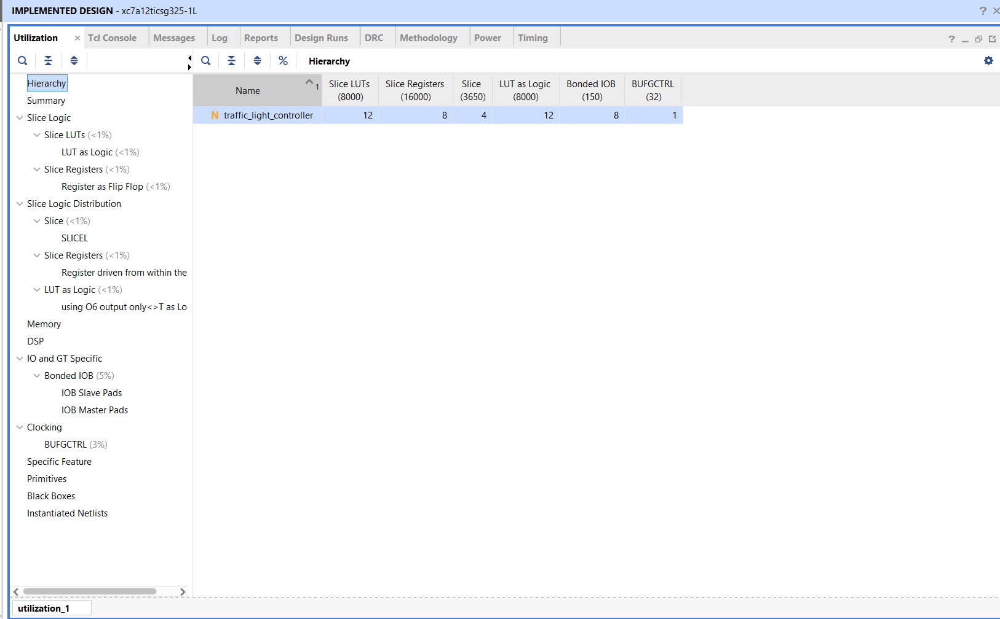

# Traffic Light Controller using Verilog HDL

## Overview

This project implements a Traffic Light Controller (TLC) using Verilog HDL based on a Moore Finite State Machine (FSM) architecture. The design was developed and verified using AMD Vivado 2025.2.

The project demonstrates the complete RTL design flow:

* FSM Design
* RTL Coding
* Behavioral Simulation
* RTL Synthesis
* Hardware Resource Analysis
* FPGA Implementation

---

## Project Specifications

### Traffic Light Sequence

| State | Highway Road | Side Road |
| ----- | ------------ | --------- |
| S0    | Green        | Red       |
| S1    | Yellow       | Red       |
| S2    | Red          | Green     |
| S3    | Red          | Yellow    |

The sequence continuously repeats:

S0 → S1 → S2 → S3 → S0

---

## FSM Architecture

This controller is implemented using a Moore FSM.

### State Diagram



### State Transition Table



---

## RTL Design

The design consists of:

* State Register
* Next State Logic
* Output Logic
* Timer Counter

### RTL Source

[View RTL Code](traffic_light_controller.v)

### Testbench

[View Testbench](traffic_light_tb.v)
---

## Verification

Behavioral simulation was performed using Vivado Simulator.

### Simulation Waveform



Verified functionality:

* Correct FSM transitions
* Proper timer operation
* Correct traffic light outputs
* Reset functionality

---

## Synthesis Results

RTL was synthesized successfully in Vivado.

### Synthesized Schematic



The synthesized hardware contains:

* FDRE Flip-Flops
* LUT-based combinational logic
* Counter implementation
* FSM logic

---

## Resource Utilization

### Utilization Report



Resource Summary:

| Resource        | Used |
| --------------- | ---- |
| Slice LUTs      | 12   |
| Slice Registers | 8    |
| Bonded IOB      | 8    |
| BUFGCTRL        | 1    |

---

## Tools Used

* Verilog HDL
* AMD Vivado 2025.2
* Artix-7 FPGA Architecture

---

## Key Learning Outcomes

* Finite State Machine (FSM) Design
* Moore FSM Architecture
* RTL Coding in Verilog
* Sequential vs Combinational Logic
* Behavioral Simulation
* RTL Synthesis
* FPGA Resource Analysis
* Vivado Design Flow

---


```
## Author

Mokshith K G

Electronics and Communication Engineering

VLSI Frontend Design Enthusiast
